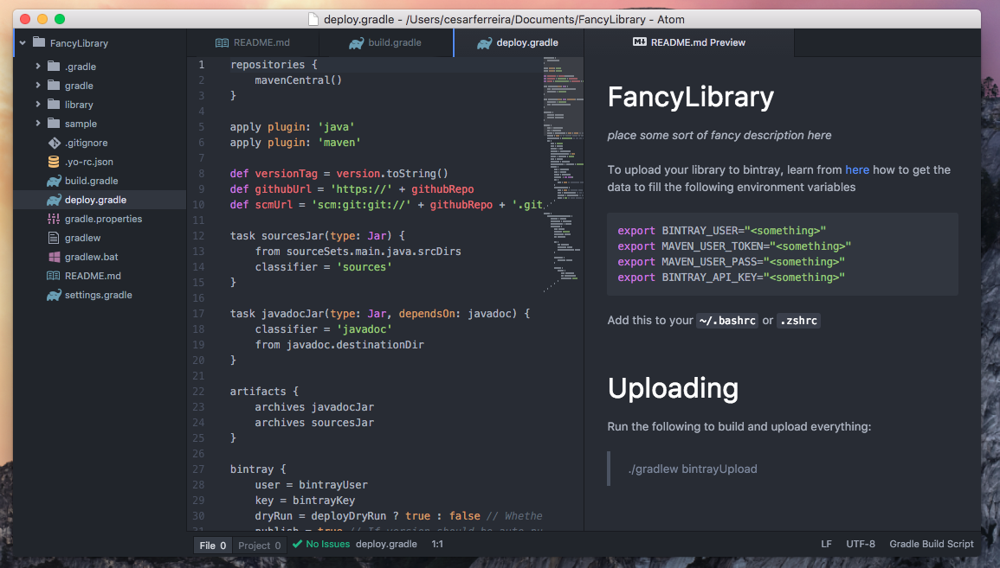

# generator-android-library
> Boilerplate code for creating an android library
[![NPM version][npm-image]][npm-url] [![Build Status][travis-image]][travis-url] [![Dependency Status][daviddm-image]][daviddm-url]

---

<p align="center">

</p>

## Installation

First, install [Yeoman](http://yeoman.io) and generator-android-library using [npm](https://www.npmjs.com/) (we assume you have pre-installed [node.js](https://nodejs.org/)).

```bash
npm i -g yo
```

### For developers modifying `generator-android-library` itself

Test new features on your workstation.

```bash
$ git clone https://github.com/gregswindle/generator-android-library.git
$ cd generator-android-library
$ npm link
```

### For general users

```bash
npm install -g generator-android-library
```

Then generate your new project:

```bash
yo android-library
```

## License

MIT © [cesarferreira](http://cesarferreira.com)


[npm-image]: https://badge.fury.io/js/generator-android-library.svg
[npm-url]: https://npmjs.org/package/generator-android-library
[travis-image]: https://travis-ci.org/cesarferreira/generator-android-library.svg?branch=master
[travis-url]: https://travis-ci.org/cesarferreira/generator-android-library
[daviddm-image]: https://david-dm.org/cesarferreira/generator-android-library.svg?theme=shields.io
[daviddm-url]: https://david-dm.org/cesarferreira/generator-android-library
[coveralls-image]: https://coveralls.io/repos/cesarferreira/generator-android-library/badge.svg
[coveralls-url]: https://coveralls.io/r/cesarferreira/generator-android-library
